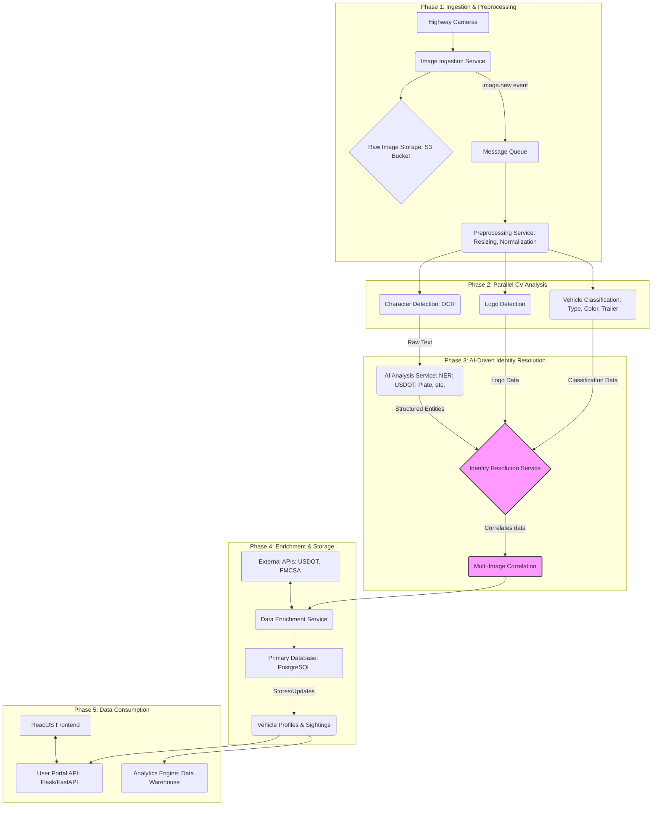

# Genlogs Platform — Architecture & Design

> **Purpose:** Transform raw highway camera images into a unified, trustworthy, and queryable database of vehicle sightings and carrier intelligence with high scalability, resilience, and modularity.

---

## 1) Architectural Overview

- **Style:** Microservices + asynchronous, event-driven data pipeline.
- **Core Principle:** Each service is independently deployable, horizontally scalable, and loosely coupled via durable queues and streams.
- **Processing Model:** Fan-out parallel CV analysis → AI-driven identity resolution → enrichment → storage → consumption.
- **Data Guarantees:** At-least-once processing with idempotent writes; eventual consistency across downstream consumers.
- **Resilience:** Backpressure via queues, autoscaling workers, circuit breakers, bulkheads, and dead-letter handling.

### High-Level Data Flow

1. **Ingest & Preprocess** raw images → durable object storage; publish work items to queue.
2. **Parallel CV Analysis** (OCR, Logo, Vehicle Classification) → emit structured features to an event stream.
3. **AI Identity Resolution** merges features by `sighting_id`, correlates with nearby/previous sightings.
4. **Enrichment** with authoritative external APIs → persist normalized records in **Primary DB**.
5. **Consumption** via **Portal API** and **React Frontend**; continuous replication to **Analytics Engine**.

---

## 2) System Phases & Modules

### Phase 1 — Ingestion & Preprocessing

**Objective:** Normalize incoming imagery and stage it for model-ready analysis.

**Modules**

- **Image Ingestion Service**
  - **Responsibility:** Accept HD images; write to **Object Storage** (e.g., S3/GCS) and publish `image.new` event.
  - **Constraints:** High throughput; minimal synchronous work; content-length validation; MIME/type sniffing; checksum.
  - **Scaling:** Stateless, autoscale behind API gateway / LB.
- **Message Queue** (e.g., SQS/RabbitMQ/Kafka topic `ingest.images`)
  - **Role:** Decouple ingestion from preprocessing; buffer bursts; preserve ordering *per camera* if needed via partition key.
- **Preprocessing Service**
  - **Responsibility:** Fetch image → standardize format & shape (e.g., 1024×1024), contrast/denoise, color normalization.
  - **Output:** Preprocessed image → object storage; emit `image.preprocessed` with `sighting_id`, `image_url_preprocessed`.

**Information Flow**

- Cameras → **Image Ingestion** → (store) **Object Storage** → (publish) **Message Queue** → **Preprocessing** → (store) **Object Storage** → (publish) `image.preprocessed`.

**Design Rationale**

- Decouples camera upload spikes from compute; preprocessing boosts downstream model accuracy and stability.

---

### Phase 2 — Parallel Computer Vision (CV) Analysis

**Objective:** Extract orthogonal features in parallel to minimize latency and maximize accuracy.

**Modules**

- **Character Detection (OCR) Service** → raw text strings.
- **Logo Detection Service** → `{ logo: vendor, confidence }`.
- **Vehicle Classification Service** → `{ vehicle_type, color, trailer_type, confidence }`.

**Execution Pattern**

- All services subscribe to `image.preprocessed` (fan-out). Each fetches image and publishes structured results to a high-speed event stream (e.g., Kafka topics `cv.ocr`, `cv.logo`, `cv.vehicle`).

**Design Rationale**

- Specialization enables model lifecycle independence and higher accuracy. Fail-soft: one model failing does not block others.

---

### Phase 3 — AI-Driven Identity Resolution

**Objective:** Synthesize features (NER entities, logos, classifications) into a single, reliable **sighting\_event** and **vehicle\_profile**.

**Modules**

- **AI Analysis Service (NER)**
  - Input: OCR raw text.
  - Output: Structured entities (e.g., `USDOT_NUMBER`, `LICENSE_PLATE`, `MC_NUMBER`, `STATE`…).
- **Identity Resolution Service**
  - Listens for all features by `sighting_id`.
  - Performs rule-based + ML heuristics to unify attributes; applies confidence scoring.
  - **Multi-Image Correlation Logic**: queries recent, nearby sightings to deduplicate and stitch trips.

**Information Flow**

- NER, Logo, Vehicle outputs → **Identity Resolution** → unified **sighting\_event** with `vehicle_profile` reference.

**Design Rationale**

- Handles partial/ambiguous observations, multi-angle images, and noisy text via correlation and confidence-driven fusion.

---

### Phase 4 — Enrichment & Storage

**Objective:** Validate and complete records; persist in a clean, query-optimized schema.

**Modules**

- **Data Enrichment Service** → calls **External APIs** (USDOT, Safer FMCSA) using `USDOT_NUMBER`/carrier.
- **Primary Database** (PostgreSQL) → normalized schema: `vehicle_profiles`, `sighting_events`, `carrier_data`, etc.

**Information Flow**

- Unified record → **Enrichment** → augmented payload → **Primary DB** upsert (create/update `vehicle_profile`, insert `sighting_event`).

**Design Rationale**

- Adds authoritative business context; RDBMS ensures integrity and supports complex analytical queries for the Portal and BI.

---

### Phase 5 — Data Consumption & Product Ecosystem

**Objective:** Turn data into user experiences and analytics.

**Modules**

- **User Portal API** (Flask/FastAPI) → query endpoints, authn/z, aggregation.
- **React Frontend** → map visualizations (Google Maps), search and filtering, reporting.
- **Analytics Engine** (DW/Lakehouse) → receives CDC/stream from Primary DB for BI and long-term trends.

**Information Flow**

- Frontend → **Portal API** → **Primary DB** (read). DB also streams/ETLs → **Analytics Engine**.

**Design Rationale**

- Isolates user-facing latency from pipeline variability; maintains scalable analytics without burdening OLTP.

---

## 3) Architecture Diagram (Mermaid)

---
## 4) Key Architectural Characteristics

- Hybrid Event-Driven Microservice Architecture

- Asynchronous Communication for scalability.

- Microservices for modularity, dentity-decoupling and resilence.

- Parallel Processing for speed.

- Message queues menage flow events and temporary data store

---

